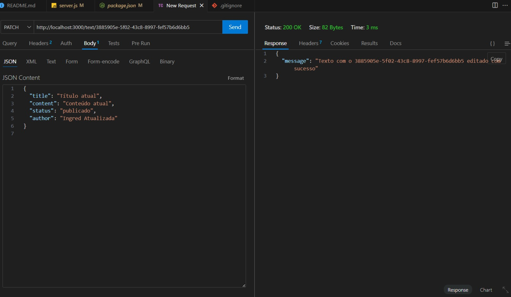
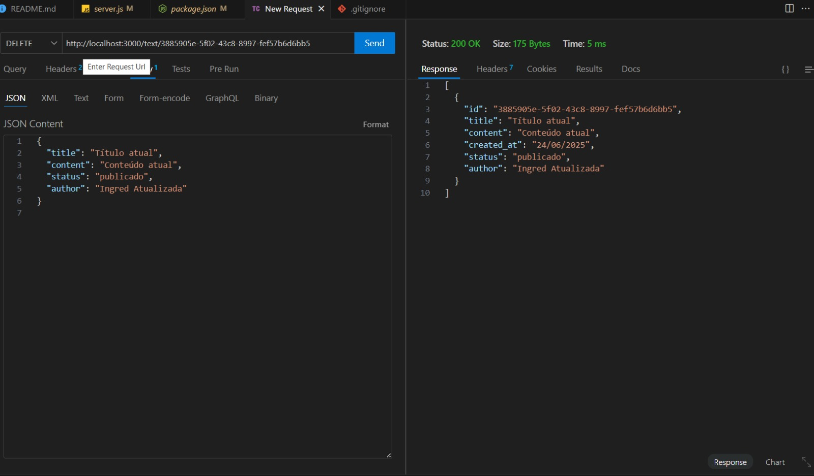

# 📌 Projeto1-Api-Aprofunda

## 📝 Descrição
Este é um projeto de **API de Gerenciamento de Tarefas**, criado com o objetivo de praticar a criação de rotas e operações CRUD utilizando dados em memória. A API permite listar, criar, detalhar por id, atualizar e deletar tarefas.

---

## 📁 Estrutura do Projeto


---

## 🚀 Funcionalidades da API

### 🔍 GET
- `GET /tasks` - Lista todas as tarefas.
- `GET /tasks/:id` - Retorna os detalhes de uma tarefa específica pelo ID.

### ✍️ POST
- `POST /tasks` - Cria uma nova tarefa.
  - Corpo esperado (JSON):
    ```json
    {
      "title": "Nova tarefa",
      "description": "Descrição da tarefa"
    }
    ```

### 🛠 PUT
- `PUT /tasks/:id` - Atualiza uma tarefa existente pelo ID.
  - Corpo esperado (JSON):
    ```json
    {
      "title": "Tarefa atualizada",
      "description": "Descrição atualizada"
    }
    ```

### ❌ DELETE
- `DELETE /tasks/:id` - Remove uma tarefa existente pelo ID.

---

## 💡 Tecnologias Utilizadas
- Node.js
- Express
- Postman ou Thunder Client (para testes)

---

## 🛠 Conteúdo Desenvolvido
- Criação e configuração do servidor com Express.
- Utilização de um array de objetos para simular um banco de dados (dados em memória).
- Estruturação de rotas RESTful.
- Testes realizados no **Thunder Client** ou **Postman**.

---

## ✅ Tarefa Concluída

- [x] Criar as rotas **PUT** e **DELETE** por ID.
- [x] Testar essas rotas usando ThunderClient ou Postman.

---

## 📸 Exemplos de Testes

### ✅ Teste com Thunder Client - PUT Update Task
  

### ✅ Teste com Thunder Client - DELETE Task
  
